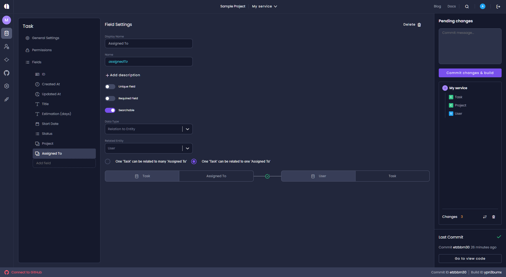
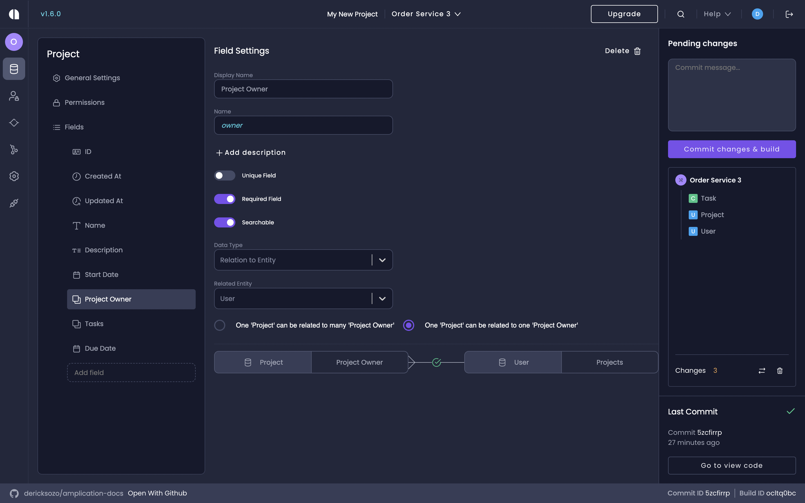

# Building New Versions of Your Service

In the [previous guide](/entities-roles-permissions/) you learned how to create entities, add roles, and set permissions for your service.

In this guide we'll take it further by adding another entity, making changes to an existing entity, and learning how to compare changes before building and committing.

Let's get started.

## Prerequisites

:::info
In order to proceed with this guide, please ensure you have completed at least the following:

1. [Set up your service](/first-service/) with our service creation wizard.
2. [Add entities, roles, and permissions](/entities-roles-permissions/) to your service and make your first build.
:::

## Step 1 - Create the Task Entity

Let's add another entity to your service called _Task_.

1. On the _Overview_ page, click **Go to Entities**, or from the main menu (left sidebar) click the **Entities** icon.
2. Click **Add entity**.
3. In the _New Entity_ dialog, type in _Task_.
4. Click **Create Entity**.
5. The entity comes with a few default fields. We'll add some more fields as follows.

| Field Name        | Data Type          | Properties                                                                              |
| ----------------- | ------------------ | --------------------------------------------------------------------------------------- |
| Title             | Single Line Text   | Required                                                                                |
| Estimation (days) | Whole Number       |                                                                                         |
| Start Date        | Date Time          |                                                                                         |
| Status            | Option Set         | Required, 4 options: <ul><li>New</li><li>Pending</li><li>Ongoing</li><li>Done</li></ul> |
| Project           | Relation to Entity | Related to: Project                                                                     |
| Assigned To       | Relation to Entity | Related to: User                                                                        |

The Task's field list should now look like this:

:::info
Refer back to the [Set Up Entities, Roles, and Permissions On Your Service](/entities-roles-permissions/#step-1---create-an-entity) guide for specific steps on setting up an entity on your service.
:::

## Step 2 - Update the Project Entity

We'll now make a few changes to the _Project_ entity.

1. On the _Overview_ page, click **Go to Entities**, or from the main menu (left sidebar) click the **Entities** icon.
2. Select the _Project_ entity.
3. Add a new field called **Due Date** and set its data type to "Date Time".
4. Select the existing _Owner_ field and change its _Display Name_ to "Project Owner".

## Step 3 - Compare Pending Changes Before Commit

It's always good to check what was changed before you commit to verify that these changes were intentional.
To do so:

1. Click **Compare Changes**. (Note: **Compare Changes** icon is next to **Delete** icon)
2. The _Pending Changes_ page opens and indicates what was changed and what was added.

- The _Task_ entity was created
- The _Project_ entity was updated

3. Since these changes were intentional and we're happy to commit them, write a new commit message in the text box at the top of the _Pending Changes_ sidebar.

4. Click **Commit changes and build**.

## You're Done

Great! You just made some new changes to your service, built it, and Amplication automatically created a new pull request with those changes to GitHub. Great work!

