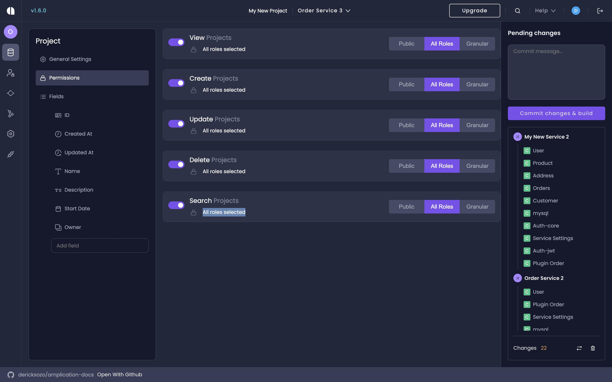
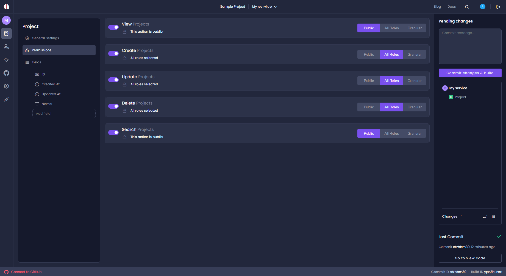
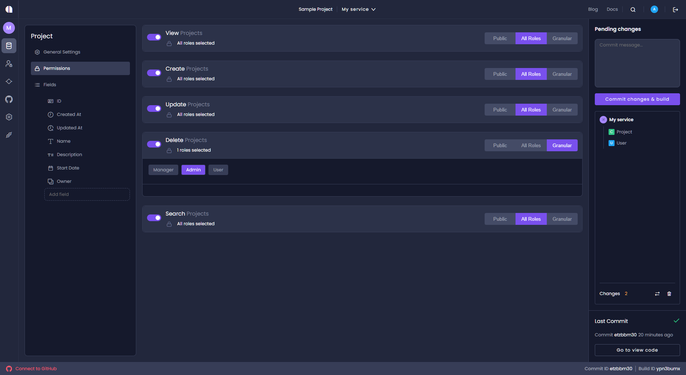

# Configure Roles and Permissions On Your Service

When creating entities, you can also specify which roles can perform actions on the entity and any of its fields.
These actions are Create, View, Update, Delete, and Search.
These permissions will be automatically enforced throughout your service.
Users can easily be assigned to multiple roles in your application.

In this introductory guide, you'll assign roles and permissions to some of your newly created entities.

Let's get started.

## Prerequisites

:::info
If you haven't set up your service or created entities yet, [create your first service](/first-service/) and [set up entities](/set-up-entities) first.
:::

## Step 1: Create Roles

1. Click the Roles icon on the main menu (left sidebar) to reach the _Roles_ page. Here you see all the roles in your service.
1. On the _Overview_ page, click **Go to roles**, or from the main menu (left sidebar) click the **Roles** icon.

:::tip
Currently, there's only a default **User** role that was auto-generated when you created the new service.
:::

In this example, we add another two roles: _Admin_ and _Manager_.

1. In the _Type role name_ text box, type "Admin".
2. Click **Add Role** \(or just press Enter\). The new role is added to the list.
3. Repeat these steps to add the "Manager" role.

## Step 2: Set Access Permissions

In order to allow users to access the entity, we need to set its permissions. To access your service's permissions:

1. On the _Overview_ page, click **Go to Entities**, or from the main menu (left sidebar) click the **Entities** icon.
2. Click the _Project_ entity.
3. In the _Project_ page click the _Permissions_ tab. This opens the Permissions settings.

Permissions can be controlled separately for each of the following actions:

- **View**
- **Create**
- **Update**
- **Delete**
- **Search**

These actions can be set to one of the following:

- **Public** - no authentication is required, so the action is available to all users, not only those with defined roles
- **All Roles** - all roles can perform the action
- **Granular** - only specified roles can perform the action

## Step 3: Set Entity Permissions

By default, all of the actions are set as **All Roles**.

In this example, some of the actions have been changed to **Public**, while the others remain as **All Roles**

In the following example, we use the **Granular** setting to fine-tune the permissions for a role.

1. By default, all actions (_View_, _Create_, _Update_, _Delete_, and _Search_) are set to **All Roles**.
2. Fine tune permissions by changing the *Delete* permissions from **All Roles** to **Granular** and then select from the displayed roles the _Admin_ role. This ensures that only users with the _Admin_ role can delete projects.

:::tip
Once you have selected **Granular** on an action such as _Delete_, you have to select specific roles, or no one at all can use that action.
:::

## Step 4: Set Field Permissions

We will now set permissions at the field level.

1.  In the **Update** action, click **+ Add Field** and select the **Start Date** and **ID** fields from the drop-down list.

2. We now select the roles to associate with each selected field.

   In this example, for the _Update_ action, apply **Admin** permissions to the **startDate**, and apply both **Admin** and **Manager** permissions to the **id** field. To do this, you first need to select **Admin** and **Manager** from the roles on this action, so you can apply those roles on the specific fields.

## Next Steps

Now you know how to various roles and permissions to the entities and fields for your service.

In the next guide, you'll learn how commit changes to your git provider, compare changes before commiting, and build new versions of your service.

You'll also learn more about how Amplication automatically tracks your code and changes in a git repository.

[Commit Changes and Build New Versions Of Your Service](/commit-and-build-new-versions)
