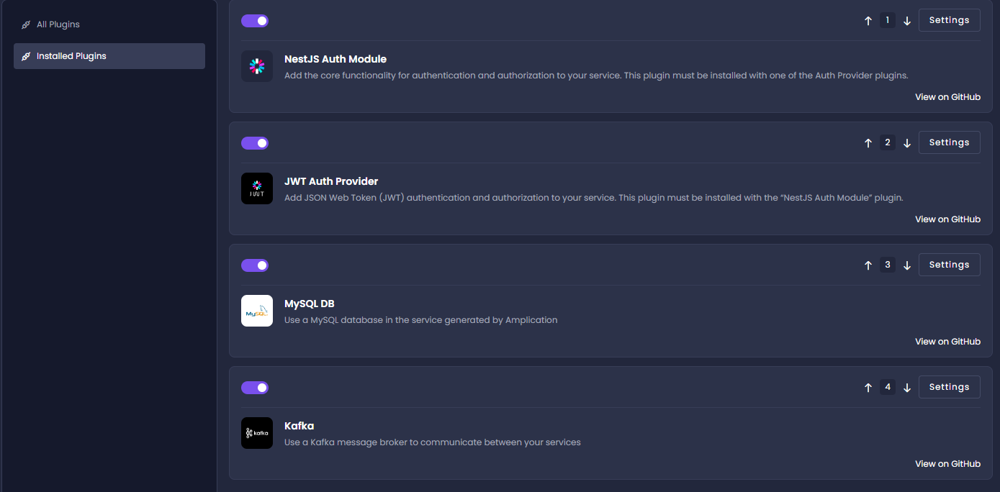

Plugins are custom code that extend the functionality of your generated application.

Amplication includes [official plugins](//plugins-list) by default. To add more functionality, you can [develop your own plugins](/plugins/overview), or can use plugins developed by the community, as they become available.

All the official plugins are available on the _All Plugins_ screen in the Amplication dashboard.
Your installed plugins for a particular service are shown on the _Installed Plugins_ screen.

This guide will teach you how to install a plugin, manage plugin versions, and access the plugins list.

## How To Install A Plugin

1.  In the _All Plugins_ page, click **Install** for the required plugin.

2. Go to the _Installed Plugins_ page. The installed plugins are listed.

3. To see the plugin on gitHub, select **View on GitHub**.

## Access the Official Plugins List 

You can view all official plugins on the _All Plugins_ page.
They're also available on the [Official Plugins](/plugins-list) page here on the Amplication documentation.

## Order of Plugin Execution

The plugins are executed when Amplication generates code, according to their order on the *Installed Plugins* page.

If a plugin execution is a prerequisite for another plugin, it must be located earlier in the list.

- To change the order of the installed plugins, click the up or down arrow to the right of the plugin bar.
- To activate or deactivate the plugin, click the toggle switch.

## How To Manage Plugin Versions

Amplication plugin developers may release several versions of a plugin over time. By default, the latest version will be available when installing the plugin.

Sometimes, you might need to generate a project with an earlier version of the plugin, to ensure compatibility.

### Changing the Plugin Version

By default, the latest version of the plugin will be available in the list of plugins.

1. To change the installed version of a plugin, in the **All Plugins** page, click the **Settings** icon.

   The plugin’s settings page opens.

   

2. Select the required plugin version from the Plugin version drop-down list and click **Save**.

   In the next build, the code will be generated with the selected plugin version.

:::note
Each version of the Plugin has its own settings, so when you replace the version you also replace its settings.
:::

## How To Develop Custom Plugins

To add more functionality, you can develop your own plugins, or can use plugins developed by the community, as they become available.

See [Plugin Development Overview](/plugins/overview/) for more information.
