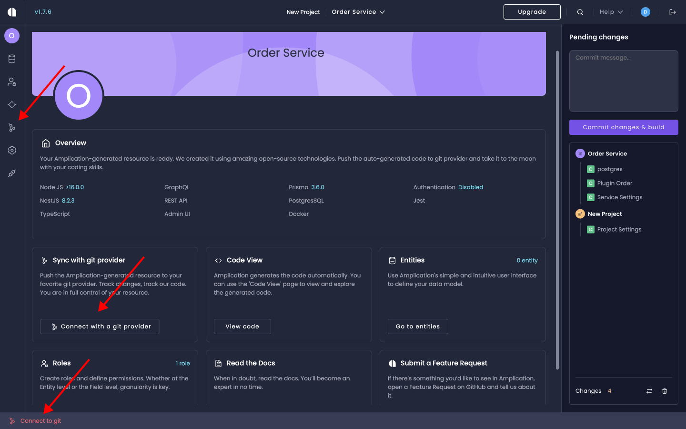
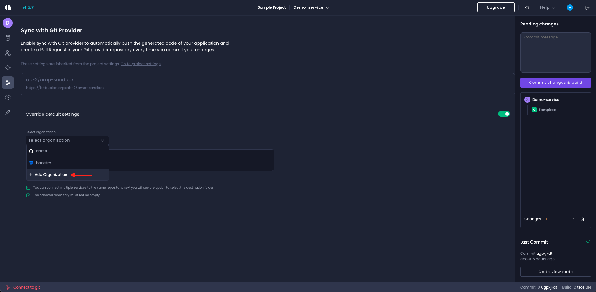
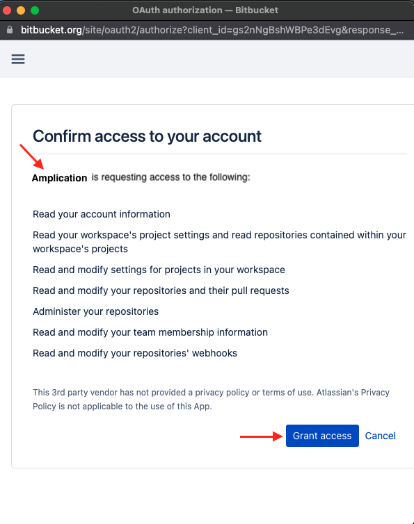
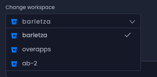
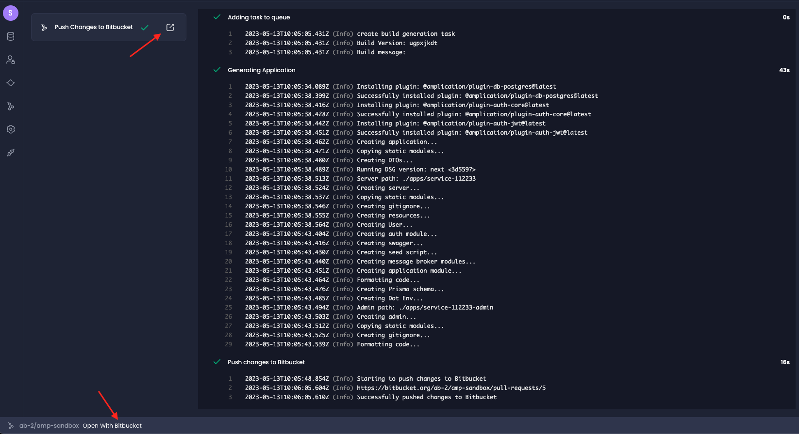

# Sync with Bitbucket

Amplication can push the code of your app to a Bitbucket repository. It will provide you with full control over your project and will also allow you to easily track the code generated by Amplication.

:::note
Amplication Free Plan works differently from the Pro and Enterprise Plans. See: [Differences between sync with a Git provider in Free edition and Pro/Enterprise Plans](/docs/getting-started/sync-with-git-diffrences-between-plans.md)
::: 

## Creating a new repository on Bitbucket

If you want to create a new repository on Bitbucket, start by navigating to your Bitbucket account and selecting the workspace where you'd like the new repository to be created. Once you're in the chosen workspace, simply click on 'Create Repository'. The URL for this action will typically look like this: `https://bitbucket.org/{your-bitbucket-workspace}/workspace/create/repository`

## Working on Local Amplication Server

If you are hosting a local Amplication server, you should first read [Connect Amplication server to Bitbucket](/docs/running-amplication-platform/connect-server-to-bitbucket.md) to see how to configure the Server to work with a new Bitbucket application.

## Using the Amplication hosted service

If you are using the hosted service on [https://app.amplication.com](https://app.amplication.com/), you can continue with this article.

## Authorize Amplication to access your Bitbucket account

Before integrating your application with Bitbucket, you need to authorize Amplication to get access to your Bitbucket account.

1. Open up an Amplication project.
2. Click **Connect to git provider** at the sidebar or at the tile of your resource overview 

This wil lead you to _Sync with git provider_ page. Click on "Add organization" and on the opened modal, chose connect to Bitbucket:

You will be redirected to Bitbucket's authorization server and a page will then be displayed, outlining that the Amplication's OAuth consumer is requesting access to the resources on you Bitbucket accont.

:::note
If you are not logged in to your Bitbucket accont, the Bitbucket's authorization server will request you to log in first.
:::

Once the connection is established, you have the flexibility to either create a new Bitbucket repository or connect to an existing one. Regardless of the option you choose, you will need to select the Bitbucket workspace. If you're creating a new repository, this will be the workspace where your new repository will reside. If you're connecting to an existing repository, this should be the workspace where your current repository is located.

## Create a New Pull Request in Bitbucket
To initiate a new pull request in Bitbucket, follow these steps:

- Navigate to the right side of the page and click on "Commit Changes & Build", followed by clicking on the most recent commit.
- This action will take you to the commits page. Here, select the service for which you wish to view the build log.
- Once the build process is completed, you can open a pull request. You can do this by clicking either on the footer or on the "Push Changes to Bitbucket" action step. 

And there you have it – a new pull request ready for review.

