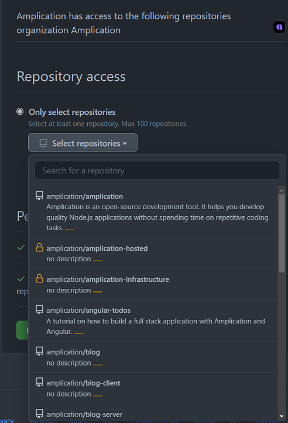
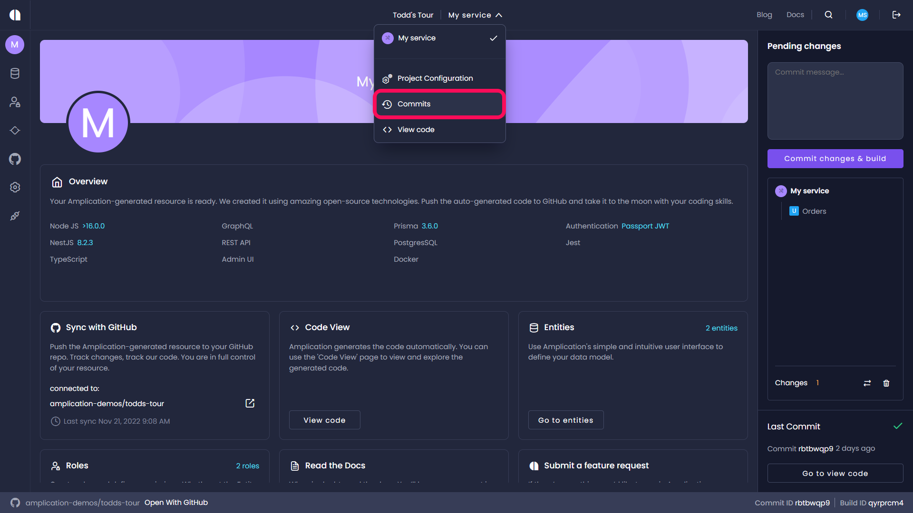

# Sync with GitHub

Amplication can push the code of your app to a GitHub repository. It will provide you with full control over your project and will also allow you to easily track the code generated by Amplication.

:::note
Amplication Free Plan works differently from the Pro and Enterprise Plans. See "Differences between GitHub sync Free edition and Pro/Enterprise Plans" below for details.
::: 

## Creating a new repository in GitHub

If you want to create a new repository in GitHub, you can do so [here](https://github.com/new). Select **Initialize this repository with a README file** to make sure the new repository is not empty.

## Working on Local Amplication Server

If you are hosting a local Amplication server, you should first read [Connect Amplication server to GitHub](https://docs.amplication.com/running-amplication-platform/connect-server-to-github/) to see how to configure the Server to work with a new GitHub application.

## Using the Amplication hosted service

If you are using the hosted service on [https://app.amplication.com](https://app.amplication.com/), you can continue with this article.

## Authorize Amplication to access your GitHub account

Before integrating your application with GitHub, you need to authorize Amplication to get access to your GitHub account.

1. Open up an Amplication project.
2. Click **Connect to GitHub** at the bottom left of your project. The _Sync with GitHub_ screen opens.

If this is the first time that you have connected to GitHub, the **Connect to GitHub** button is displayed.
If you have already connected to GitHub, you will be prompted to choose the installed organization. If several organizations are configured, you will be prompted to select the required organization.

3. Click **Connect to GitHub**
   The _Install Amplication Github App_ opens.

4. Select the GitHub account you want to use.
5. In the new window, select on which repositories you want to install the app.

:::note
Currently, only by connecting to an organization can you create a new GitHub Repository. A User can sync only with an existing repository.
:::

## Create a new Pull Request in GitHub

1. To test the process, make a change in your application and click the **Commit changes & build** button on the right side panel.
   
2. To view your previous commits in Amplication, select the drop down from the top of the page, then click **Commits**.
   
3. To view the new Pull Request in GitHub, select the most recent commit and click **Open with GitHub**, located at the bottom of the screen.
4. You can now view the code changes generated by Amplication, and merge them.

## Differences between GitHub sync Free edition and Pro/Enterprise Plans
The GitHub sync process is for the Amplication Pro and Enterprise editions is different to the Free edition. 

### Sync with GitHub (Free Plan)

When synchronizing with GitHub using the Free Plan, the following occurs: 

- Every commit you create in Amplication Free Plan will push a new Pull Request to your GitHub repository with the updated code.
- The pull request will be created in a new branch, with the default branch of your repository (usually **master** or **main**) as a base.
- The code from Amplication will be created relative to the root of the selected repository.
- The selected repository must not be empty, so create at least one file in the root folder.

### Sync with GitHub (Pro and Enterprise Plans)

When synchronizing with GitHub using the Pro or Enterprise Plan, the following occurs: 

- **Initial Build Creation**: When you create your first build in Amplication, a new branch labeled amplication is created. All Pull Requests from Amplication are opened against this branch
- **Subsequent Builds**: Further builds will lead to additional commits within the amplication branch, given an open pull request exists. A new one will be initiated if no open pull request is found
- **Post-Merge Strategy**: After successfully merging a Pull Request, the following build will kickstart a new Pull Request, starting from the first commit of the default branch. Additional builds will continue to add commits until the next merge, keeping the process seamless and organized

### Advantages of GitHub Sync in the Pro and Enterprise Plans

 The Sync with GitHub in the Pro and Enterprise editions has the advantage over the process in    the Free editions, as follows:

- The commits are all in the same branch, creating a more organized and easily managed structure.
- Prevents conflicts that occurred when each build was in a separate Pull Request.

