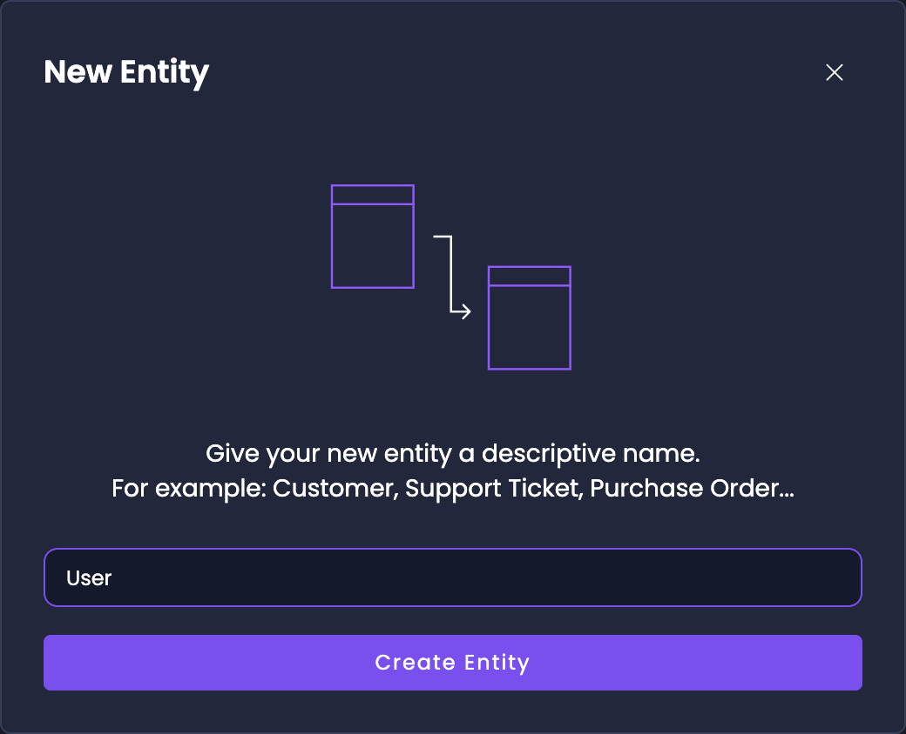
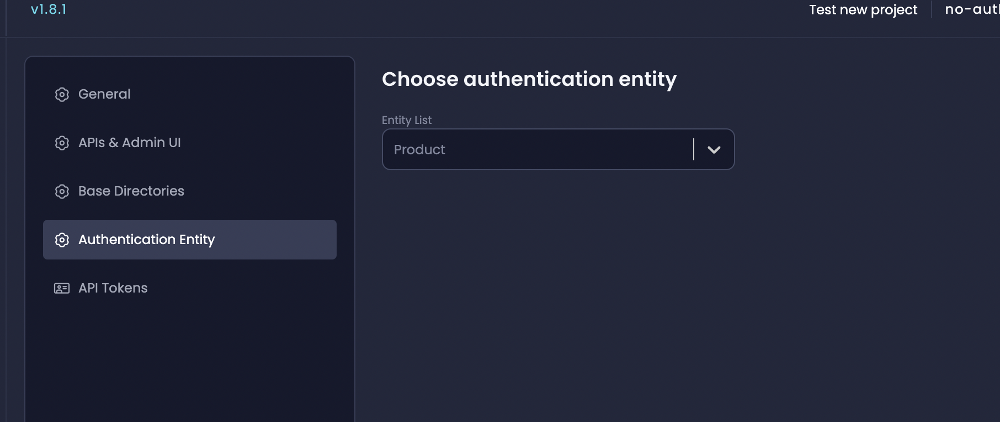

# How To Add, Delete, and Change The User Entity

The _User_ entity **is required** in order for you to enable authentication on your service.

If you choose to [create a service _without_ authentication](/authentication/#how-to-create-a-service-without-authentication) then the _User_ entity will not be created.

## Adding The User Entity

First, go into your service's _Entities_ page.
Click on the **Add Entity** button in the top right hand corner.
Type `User` into the entity name text field and then click on the **Create Entity** button.

A popup will appear and give you additional context on restoring the _User_ entity.
Click on the **Restore Default** button and the original _User_ entity provided by Amplication will be restored.

:::note
You have to add the _User_ entity first and then enable the [_NestJS Auth Module_ plugin](/authentication/#nestjs-auth-module-mandatory).
It's not possible to do this in reverse order.
:::

## Deleting The User Entity

Usually, it's possible to delete any Entity that you create on your service.
But, the _User_ entity is special.
In order to delete it, you must first disable the _NestJS Auth Module_.

:::caution
It's possible to restore the original _User_ entity provided by Amplication, but any additional fields or permissions you added will be permanently deleted.
:::

Follow these steps to delete the _User_ entity:

1. Visit your service's Plugins page and toggle the _NestJS Auth Module_ into the off state.

2. Visit your service's _Entities_ page.
You will notice that you can now click the _User_ entity's delete button. Click it and a popup will appear.

3. Click on the popup's **Delete** button. Now the User entity is deleted.

## Changing The Default User Entity

Amplication also gives you the ability to change the default User entity for each service.

Follow these steps to change the default User entity:

1. Go to your service's **Settings**.
2. Go to the **Authentication Entity** page.
3. Pick the new Entity you want to be the User entity from the **Entity List** dropdown.
4. You have now set a new User entity.
