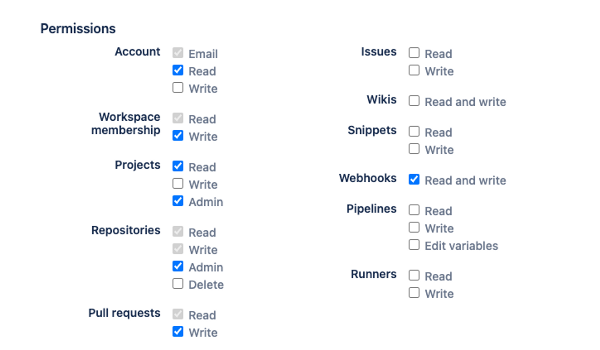
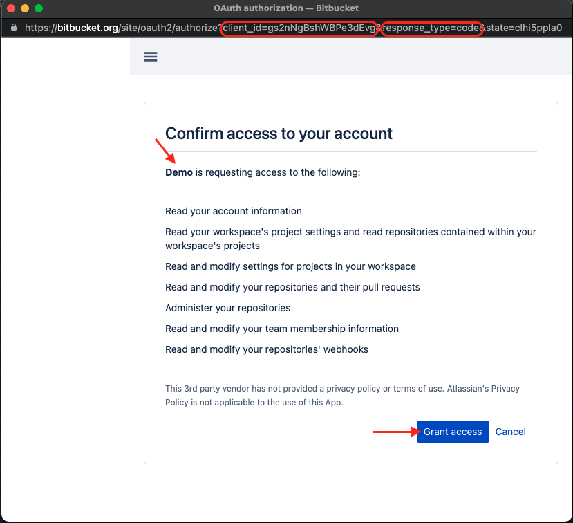

# Connect Amplication server to Bitbucket

Amplication already provides built-in integration with Bitbucket to push the generated application to a Bitbucket repository.

When running a local Amplication server you first need to configure the server to integrate with a new Bitbucket app, following the steps below.

## Step 1: Create a new Bitbucket OAuth Consumer

- Create a Bitbucket account or connect to your accont if you already have one
- Create a workspace

<iframe width="560" height="315" src="https://www.youtube.com/embed/khnDDDOGHlA" title="YouTube video player" frameborder="0" allow="accelerometer; autoplay; clipboard-write; encrypted-media; gyroscope; picture-in-picture; web-share" allowfullscreen></iframe>

- Create a Bitbucket account or connect to your accont if you already have one
- Create a workspace
- Navigate to workspace settings 
`https://bitbucket.org/{your-workspace-name}/workspace/settings`. At the bottom of the sidebar, click on **OAuth consumers**

:::note
### Few words about Bitbucket OAuth Consumer
OAuth 2.0 is a protocol that allows a user to grant a third-party application access to their resources, without sharing their credentials. An OAuth 2.0 consumer, such as a Bitbucket OAuth consumer, is an application that requests access to a user's resources. Once the user grants authorization, the consumer receives a token, which allows it to access and interact with the user's resources. In the context of Bitbucket, this could mean reading from or writing to a user's Bitbucket repositories as permitted by the granted permissions.
:::


- Click on **Add consumer**


- Fill out the **name** (whatever you want)
- **callback URL**: `http://localhost:3001/bitbucket-auth-app/callback`
- Check the following checkbox:


- Set the permissions as follow:

     - **Account** - `Read`
     - **Workspace Membership** - `Read, Write`
     - **Projects** - `Read, Admin`
     - **Repositories** - `Read, Write, Admin`
     - **Pull requests** - `Read, Write`
     - **Webhooks** - `Read and Write`



- c
Click on **Save**

:::note
 Creating a Bitbucket OAuth consumer within your own Bitbucket account might initially seem puzzling. After all, the consumer's role is to access resources on a user's behalf, and here, you are that user. But remember, the operations you are carrying out originate from the Amplication platform. It's about facilitating these actions securely without sharing your Bitbucket credentials.

If you'd rather add a degree of separation, feel free to create a separate Bitbucket account just for hosting the OAuth consumer. You can then register your primary Bitbucket account with this consumer
:::

## Step 2: Configure Amplication server and Amplication git-pull-request to work with the newly created Bitbucket OAuth consumer
- Next to your newly created OAuth consumer name, you have a `>`
- Clicking on it will reveal the Key (clientId) and the Secret (clientSecret)
- In your `packages/amplication-server/.env.local` **and** `packages/amplication-git-pull-request-service/.env.local` files add the following environment variables:

```bash
# Bitbucket OAuth Consumer Key
BITBUCKET_CLIENT_ID={YOUR_CLIENT_ID}
# Bitbucket OAuth Consumer Secret
BITBUCKET_CLIENT_SECRET={YOUR_CLIENT_SECRET}
```

:::note
Bitbucket is an enterprise feature only. To being able use it locally, you need to disable billing in amplication-server `packages/amplication-server/.env.local` file:
```
BILLING_ENABLED=false
```
:::

- Run the following services
```bash
# amplication-server
npx nx serve amplication-server
# amplication-client
npx nx serve amplication-client
# amplication-pull-request-service
npx nx serve amplication-git-pull-request-service
# amplication-build-manager
npx nx serve amplication-build-manager
# local-data-service-generator-controller
npx nx serve local-data-service-generator-controller
```

## Step 3: Running locally
- Click on one of your service or create a new service and connect it to Bitbucket

- You will be redirected to Bitbucket's authorization server. The URL will look something like this: `bitbucket.org/site/oauth2/authorize`, with your OAuth consumer client ID included as a query parameter.

- A page will then be displayed, outlining that the OAuth consumer (represented as "Demo" in our screenshot) is requesting access to the resources you specified earlier in the permissions setup for the OAuth consumer.



The `response_type=code` in the context of OAuth 2.0, it signifies that Bitbucket's authorization server will respond by sending an authorization code to the callback URL that we've set up, which in our case, is the amplication-client.

amplication-client then forwards this code to the Amplication server. If the received code is as expected (and all the environmet variables are set as expected), the Amplication server responds with a token. That means that your local consumer granted permissions to your Bitbucket account.

- Once the connection is established, you have the flexibility to either create a new Bitbucket repository or connect to an existing one. Regardless of the option you choose, you will need to select the Bitbucket workspace. If you're creating a new repository, this will be the workspace where your new repository will reside. If you're connecting to an existing repository, this should be the workspace where your current repository is located.


- From this point, everything works the same as describing on [Sync with Bitbucket](/docs/getting-started/sync-with-bitbucket.md#create-a-new-pull-request-in-bitbucket)

